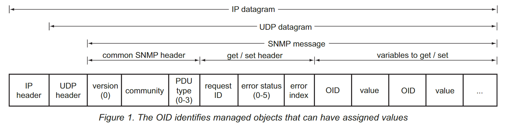

# SNMP

## MIB(Management Information Base)

SNMP 장치를 이해하기 위해서는 MIB 파일에 대해 알 필요가 있다.

- MIB 파일의 목적
- MIB 파일을 읽는 방법
- MIB로 SNMP 장치를 평가하는 방법

## What is the MIB ?

SNMP 네트워크 요소를 데이터 객체 리스트로 설명하는 텍스트 파일이다.

SNMP를 이용하기위한 사전으로 사용되며, 모든 SNMP 메시지는 MIB에 나열되어 있어야한다.

## What does the MIB do?

MIB의 목적은 숫자로 이루어진 문자열을 사람이 읽을 수 있도록 변환된 글이다.

SNMP 장치가 `Trap`이나 `Message`를 보낼 때, 객체 식별자나 OID를 이용해 개체를 식별한다.

## Why do I need the MIB ?

SNMP 관리자는 장치가 보내는 메시지를 처리하기 위해서 MIB 파일이 필요하며, MIB 파일이 없다면 `숫자로 이루어진 문자열(이하 OID)`는 의미없는 글자일뿐이다.

## How do I get the MIB into my SNMP manager?

SNMP manager는 컴파일을 통해서 MIB를 가져오며, 이진 데이터로 컴파일 하여 사용한다.

## Why is the MIB important?

MIB에 장치의 센서에 대한 정보가 있지 않으면, 장치에 문제가 생기더라도 그것을 우리는 파악할 수 없다...

## Why do I need to understand the MIB?

SNMP 모니터링을 위해서는 MIB 파일을 읽을 수 있어야하고, 그래야 지금 가지고 있는 기능을 통한 아이디어를 얻을 수 있다. 새로운 SNMP 장비를 평가할떄 MIB 파일을 주의깊게 보아야한다.

--> 어떤 기능을 제공하는지 알 수 있다.

## How do I look at a MIB?

MIB 파일은 ASCII 텍스트 파일일 뿐이고, 메모장이나 다른 응용프로그램으로 읽을 수 있다.

가끔 MIB파일을 UNIX 텍스트로 제공되기도 한다.

UNIX 텍스트로 된 파일을 읽기 위해서는 변환이 필요하다.

## Will I need to edit the MIB?

직접 작성하지 않아도 상관없다.

## How do I read the MIB?

MIB를 읽기 위해서는 MIB의 구조에 대해서 알아야한다.

## What does a MIB look like?

```mib
DPS-MIB-V38 DEFINITIONS ::= BEGIN
IMPORTS
    DisplayString
        FROM RFC1213-MIB
    OBJECT-TYPE
        FROM RFC-1212
    enterprises
        FROM RFC1155-SMI;
dpsInc OBJECT IDENTIFIER ::= {enterprises 2682}
dpsAlarmControl OBJECT IDENTIFIER ::= {dpsInc 1}
tmonXM OBJECT IDENTIFIER ::= {dpsAlarmControl 1}
tmonIdent OBJECT IDENTIFIER ::= {tmonXM 1}
tmonIdentManufacturer OBJECT-TYPE
    SYNTAX DisplayString
    ACCESS read-only
    STATUS mandatory
    DESCRIPTION “The TMON/XM Unit manufacturer.”
    ::= {tmonIdent 1}
tmonIdentModel OBJECT-TYPE
    SYNTAX DisplayString
    ACCESS read-only
    STATUS mandatory
    DESCRIPTION “The TMON/XM model designation."
```

## Wow! What language is that?

MIB 파일은 ASN.1으로 작성되었다.

(※.ASN = Abstract Syntax Notation)

### ASN

1. 사람이 읽을 수 있다.
2. 모든 시스템에서 호환된다.
3. 모든것에 대해서 확장이 가능하도록 만들어졌다.
4. 한번 정의된 용어는 다른 용어를 만들때도 요소로 사용할 수 있다.(변수의 개념, 가장 중요)

## How ASN.1 builds new terms out of existing terms

```asn
Letter ::= SEQUENCE {
    opening     OCTET STRING,
    body        OCTET STRING,
    closing     OCTET STRING,
    address     AddressType
}
```

위에서 opening, body, closing은 OCTET STRING으로 정의되어 있지만, address의 경우 `AddressType`으로 정의되어있다.

`AddressType`은 다음과 같이 정의할 수 있다.

```mib
AddressType ::= SEQUENCE {
    name        OCTET STRING,
    number            INTEGER,
    street      OCTET STRING,
    city        OCTET STRING,
    state       OCTET STRING,
    zipCode     INTEGER
}
```

컴퓨터는 AddressType을 파싱할때 위에서 정의된 시퀀스를 읽어낸다.

## What terms are defined in the MIB?

MIB에 정의된 요소는 구체적일수도 있고 광범위할 수도 있다.

MIB의 요소들에 의해 OID가 제공된다.

OID는 SNMP 생태계를 식별할 수 있는 고유 번호이며, 사람이 읽을 수 있는 텍스트 레이블(MIB에 정의되어 있는)과 연결된다.

## What is the fuction of an OID?

OID는 SNMP가 보내는 메시지의 데이터 개체를 식별한다.

SNMP 장치가 트랩이나 응답을 보낼때 OID를 값과 함꼐 보낸다.

ex) 1.3.6.1.4.1.2681.1.2.102

OID는 SNMP 생태계에서 특정 요소를 찾는 주소와 같다.

OID는 트리구조를 갖으며, `.`으로 구분된 곳은 가지를 뜻한다.

처음 몇개의 숫자는 발행한 조직의 도메인을 나타내고, 그 뒤의 숫자는 도메인 내의 개체를 식별할 수 있는 숫자가 위치한다.

OID는 장치의 루트 수준에서 시작하여 세부적으로 점점 더 들어간다.

OID는 사람이 읽을 수 있는 텍스트 부분도 존재한다.

예시의 OID를 해석해보면 다음과 같다.

1(iso) : 국제 표준화 기구(ISO) 혹은 OID를 할당한 조직
3(org) : ISO가 인정한 조직
6(dod) : Internet을 담당했던 국방부
1(internet) : Internet OID
4(private) : 민간 조직
1(enterprises): 기업
2681(dpsInc) : DPS Telecom
1(dpsAlarmControl) : DPS 알람과 컨트롤 장치
2(dpsRTU) : DPS 원격 측정 장치
102(dpsRTUsumPCIr) : 모든 알람이 비워지면 발생하는 Trap

하지만 MIB 파일을 읽을 경우 위와 같이 긴 숫자는 찾을 수 없다.

OID의 각 요소는 한번만 정의되면 된다.

OID의 마지막 숫자는 이전 숫자에 비해 구체적인 정보를 제공한다.

```mib
dpsInc OBJECT IDENTIFIER ::= {enterprises 2682}
dpsAlarmControl OBJECT IDENTIFIER ::= {dpsInc 1}
dpsRTU OBJECT IDENTIFIER ::= {dpsAlarmControl 2}
dpsRTUsumPClr TRAP-TYPE
    ENTERPRISE dpsRTU
    VARIABLES { sysDescr, sysLocation, dpsRTUDateTime }
    DESCRIPTION "Generated when all points clear." ::= 102
```

```
.root
├─ccitt(0)
├─iso(1)
│  │
│  └─org(3)
│     │
│     └─dod(6)
│        │
│        └─internet(1)
│              │
│              ├─directory(1)
│              ├─mgmt(2)
│              ├─experimental(3)
│              └─private(4)
│                   │
│                   └─enterprises(1)
│                          │
│                          └─dpsInc(2682)
│                               │
│                               └─dpsAlarmControl(1) ---> 1.3.6.1.4.1.2682.1
│                                       │
│                                       ├─TMonXM(1)
│                                       └─dpsRTU(2)
│                                            │
│                                            └─dpsRTUsumPClr
│
└─joint-iso-ccit(3)
```

SNMP 관리자가 OID를 컴파일 할 때, 공급업체가 정의한 OID 뿐만 아니라 공공의 OID에 대한 정보도 필요합니다.

RFC(Request For Commit)라고 부르는 표준참조 MIB 파일에 상위 레벨의 OID tree가 정의되어 있으므로 정의될 필요는 없다.

따라서 공급업체의 MIB 파일의 상위에는 RFC 파일을 호출하는 Import 부분이 존재한다.

아래의 구문을 보면 DPS MIB는 다른 세가지로 정의된 MIB들의 용어를 이용하여 작성되었다는 것을 알 수 있다.

```
DPS-MIB-V38 DEFINITIONS ::= BEGIN
    IMPORTS
        DisplayString
            FROM RFC1213-MIB
        OBJECT-TYPE
            FROM RFC-1212
        enterprises
            FROM RFC1155-SMI;
```

잘 작성된 MIB 파일은 여러 섹션으로 나뉘어 있다.

섹션은 주석으로 식별이 되며, --으로 주석을 표시한다.

따라서 아래와 같은 주석을 찾으면, 원하는 것을 찾을 수 있다.

```
-- TRAP definitions
```

찾고 있는 정보가 있다면 찾기(Ctrl-F)로 원하는 정보를 검색할 수도 있다.

## The MIB Objects you need to know

원격으로 모니터링을 하기 위해서 알아야할 몇 가지 사항들이다.

1. 해당 장치를 지원하는 다른 RFC MIBs가 무엇인지
2. 장치가 SNMP 관리자에게 보낼 수 있는 이벤트 보고서(TRAP)
3. 장치에서 요청할 수 있는 정보
4. SNMP를 통해 제어할 수 있는 장치의 특성

## RFC MIB

RFC MIB에서 가장 먼저 찾아야 할 것은 이 장치에서 필요한 MIB가 무엇인지 아는 것이다.

필요한 RFC는 MIB 시작 부분의 IMPORTS 라인에서 호출된다.

## Traps: Event Reports

모니터링을 위해 가장 필요한 것은 Trap이다.

Trap은 경보, 이벤트 보고서라고 생각하면된다.



## SNMP Message

1. common SNMP header
   A. version(0)
   B. community
   C. PDU type(0 ~ 3)
2. get/set header
   A. request ID
   B. error status(0 ~ 5)
   C. error index
3. variables to get/set
   A. OID
   B. value

```

## <------- Common SNMP Header -------> <------------ get/set Header -----------> <----- variables to get/set ----->

| | | | | | | | | | | |
| version(0) | community | PDU type | request ID | error status | error index | OID | value | OID | value | ... |
| | | | | | | | | | | |

---

```

```

```
